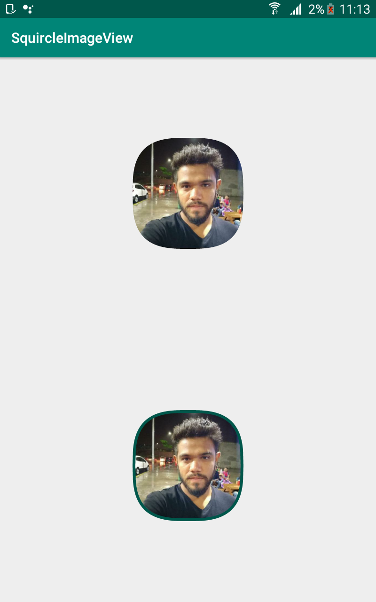

# SquircleImageView

### Description
This demo is regarding to use SquircleImageView where we can use as Imageview with this library

## Screenshot
 

### How to use it 

## Formula for creating Squircle shape on canvas
(|x|)^3 + (|y|)^3 = radius^3

## Created By

[Team Android - Inheritx](https://github.com/android-inheritx)
